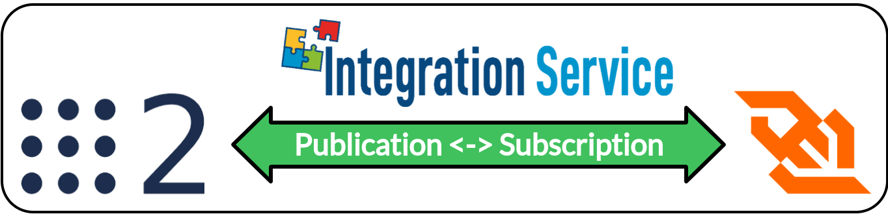
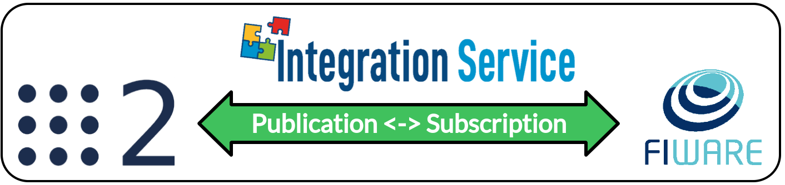
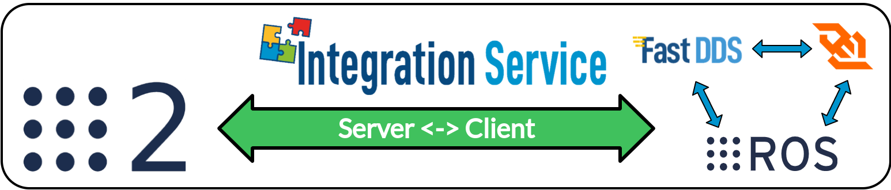

<a href="https://integration-service.docs.eprosima.com/"></a>

# ROS 2 System Handle

[](https://github.com/eProsima/ROS2-SH/actions)
&nbsp;&nbsp;[](https://github.com/eProsima/Integration-Service/issues/new)

## Introduction

### What is a System Handle?

A [System Handle](https://integration-service.docs.eprosima.com/en/latest/user_manual/systemhandle/sh.html) is a plugin that allows a certain middleware
or communication protocol to speak the same language used by the [eProsima Integration Service](https://github.com/eProsima/Integration-Service),
that is, *Extensible and Dynamic Topic Types for DDS* (**xTypes**);
specifically, *Integration Service* bases its intercommunication abilities on eProsima's open source
implementation for the *xTypes* protocol, that is, [eProsima xTypes](https://github.com/eProsima/xtypes).

<p align="center">
  <a href="https://integration-service.docs.eprosima.com/en/latest/user_manual/systemhandle/sh.html"></a>
</p>

### The ROS 2 SystemHandle

<a href="https://docs.ros.org/en/foxy/"></a>

This repository contains the source code of *Integration Service* **System Handles**
for the [ROS 2](https://docs.ros.org/en/foxy) middleware protocol, widely used in the robotics field.
Two implementations can be distinguished: **static** one based on *ROS 2* `rclcpp` and **dynamic** one based on *Fast DDS* (by the moment it is only available for the Publisher-Subscriber paradigm).

This *System Handles* can be used for two main purposes:

1. Connection between a *ROS 2* application and an application running over a different middleware implementation.
  This is the classic use-case approach for *Integration Service*.

1. Connecting two *ROS 2* applications running under different Domain IDs.

The main advantages of the *Dynamic ROS 2 System Handle* over the *Static ROS 2 System Handle* are the following ones:

1. It allows using types defined by *IDL* without previously generating and installing the ROS 2 Type
  Support for that type, which gives it a greater versatility with respect to the *Static ROS 2 System
  Handle*.

1. It is not necessary to decide which ROS 2 builtin types you are going to use during the compilation
  phase, as it allows you to use any of them.

## Dependencies

This section provides a list of the dependencies needed in order to compile *ROS 2 System Handles*.

**Static ROS 2 System Handle**

* [ROS 2](https://docs.ros.org/en/foxy/Installation.html): *Foxy/Galactic ROS 2* distribution.

**Dynamic ROS 2 System Handle**

* [Fast DDS](https://github.com/eProsima/Fast-DDS#installation-guide): eProsima C++ implementation for DDS.

## Configuration

*Integration Service* is configured by means of a YAML configuration file, which specifies
the middlewares, topics and/or services involved in the intercommunication process, as well as
their topic/service types and the data exchange flow. This configuration file is loaded during
runtime, so there is no need to recompile any package before switching to a whole new
intercommunication architecture.

To get a more precise idea on how these YAML files have to be filled and which fields they require
in order to succesfully configure and launch an *Integration Service* project, please refer to the
[dedicated configuration section](https://integration-service.docs.eprosima.com/en/latest/user_manual/yaml_config.html) of the official documentation.

Regarding the *ROS 2 System Handles*, there are several specific parameters which can be configured
for the ROS 2 middleware. All of these parameters are optional, and fall as suboptions of the main
five sections described in the *Configuration* chapter of the *Integration Service* repository:

* `systems`: The system `type` must be `ros2`. In addition to the `type` and `types-from` fields,
  the *ROS 2 System Handle* accepts the following specific configuration fields:

  ```yaml
  systems:
    ros2:
      type: ros2
      namespace: "/"
      node_name: "my_ros2_node"
      domain: 4
  ```
  * `namespace`: The *namespace* of the ROS 2 node created by the *ROS 2 System Handle*.

  * `node_name`: The *ROS 2 System Handle* node name.

  * `domain`: Provides with an easy way to change the *Domain ID* of the ROS 2 entities created
    by the *ROS 2 System Handle*.

* `topics`: The topic `route` must contain `ros2` within its `from` or `to` fields. Additionally,
  the *ROS 2 System Handle* accepts the following topic specific configuration parameters, within the
  `ros2` specific middleware configuration tag:

  ```yaml
  routes:
    ros2_to_ros1: { from: ros2, to: ros1 }

  topics:
    hello_ros1:
      type: std_msgs/String
      route: ros2_to_ros1
      ros2: { qos: {
          deadline: { sec: 1, nanosec: 10},
          durability: VOLATILE,
          history: { kind: KEEP_LAST, depth: 10 },
          lifespan: { sec: 2, nanosec: 20 },
          liveliness: { kind: AUTOMATIC, sec: 2, nanosec: 0 },
          reliability: RELIABLE
        }}
  ```

  * `qos`: The Quality of Service policies that are going to be applied to the ROS 2 entity involved in the pub-sub operation (in this case the publisher).
    This parameter accepts any of the QoS available for ROS 2:
    * `deadline`: This QoS policy raises an alarm when the frequency of new samples falls below a certain threshold, which can be defined by means of the
      `sec` and `nanosec` tags.
      On the publishing side, the deadline defines the maximum period in which the application is expected to supply a new sample.
      On the subscribing side, it defines the maximum period in which new samples should be received.
    * `durability`: A Publisher can send messages throughout a Topic even if there are no Subscribers on the network. This QoS defines how the system will
      behave regarding those samples that existed on the Topic before the Subscriber joins. There are two possible values: `VOLATILE` and `TRANSIENT_LOCAL`.
    * `history`: This QoS controls the behavior of the system when the value of an instance changes one or more times before it can be successfully
      communicated to the existing Subscriber entities.
      * `kind`: Controls if the service should deliver only the most recent values, all the intermediate values or do something in between. There are two
        possible values: `KEEP_LAST` and `KEEP_ALL`.
      * `depth`: Establishes the maximum number of samples that must be kept on the history. It only has effect if the kind is set to `KEEP_LAST`.
    * `lifespan`: Each data sample written by a Publisher has an associated expiration time beyond which the data is removed from the Publisher and Subscriber
       history. That expiration time can be defined by means of the `sec` and `nanosec` tags.
    * `liveliness`: This QoS controls the mechanism used by the service to ensure that a particular entity on the network is still alive.
      * `kind`: Establishes if the service needs to assert the liveliness automatically or if it needs to wait until the liveliness is asserted by the
        publishing side. There are two possible values: `AUTOMATIC` and `MANUAL_BY_TOPIC`.
      * `lease_duration`: Amount of time to wait since the last time the Publisher asserts its liveliness to consider that it is no longer alive. It can be
        defined by means of the `sec` and `nanosec` tags.
    * `reliability`: This QoS indicates the level of reliability offered and requested by the service.
      There are two possible values: `RELIABLE` and `BEST_EFFORT`.

  The *Dynamic ROS 2 System Handle* has an additional parameter:

  ```yaml
    systems:
      ros2:
        type: ros2_dynamic
        namespace: "/"
        node_name: "my_ros2_node"
        domain: 4
        using: [std_msgs/String, geometry_msgs]
    ```
  * `using`: List of the *ROS 2* builtin types or packages that want to be used in the communication.

## Examples

There are several *Integration Service* examples using the *Static ROS 2 System Handle* available
in the project's [main source code repository]([https://](https://github.com/eProsima/Integration-Service/tree/main/examples)).

Some of these examples, where the *Static ROS 2 System Handle* plays a different role in each of them, are introduced here.

<a href="https://integration-service.docs.eprosima.com/en/latest/examples/different_protocols/pubsub/ros1-ros2.html"></a>

### ROS 2 - ROS 1 bridge  (publisher - subscriber)

In this example, *Integration Service* uses both this *Static ROS 2 System Handle* and the *ROS 1 System Handle*
to transmit data coming from a ROS 2 publisher into the ROS 1 data space, so that it can be
consumed by a ROS 1 subscriber on the same topic, and viceversa.

<p align="center">
  <a href="https://integration-service.docs.eprosima.com/en/latest/examples/different_protocols/pubsub/ros1-ros2.html"></a>
</p>

The configuration file used by *Integration Service* for this example can be found
[here](https://github.com/eProsima/Integration-Service/blob/main/examples/basic/ros1_ros2__helloworld.yaml).

For a detailed step by step guide on how to build and test this example, please refer to the
[dedicated section](https://integration-service.docs.eprosima.com/en/latest/examples/different_protocols/pubsub/ros1-ros2.html) in the official documentation.

<a href="https://integration-service.docs.eprosima.com/en/latest/examples/different_protocols/pubsub/dds-ros2.html"></a>

### ROS 2 - DDS bridge  (publisher - subscriber)

In this example, *Integration Service* uses both this *Static ROS 2 System Handle* and the *Fast DDS System Handle*
to transmit data coming from a ROS 2 publisher into the DDS data space, so that it can be
consumed by a Fast DDS subscriber on the same topic, and viceversa.

<p align="center">
  <a href="https://integration-service.docs.eprosima.com/en/latest/examples/different_protocols/pubsub/dds-ros2.html"></a>
</p>

The configuration file used by *Integration Service* for this example can be found
[here](https://github.com/eProsima/Integration-Service/blob/main/examples/basic/fastdds_ros2__helloworld.yaml).

For a detailed step by step guide on how to build and test this example, please refer to the
[dedicated section](https://integration-service.docs.eprosima.com/en/latest/examples/different_protocols/pubsub/dds-ros2.html) in the official documentation.

<a href="https://integration-service.docs.eprosima.com/en/latest/examples/different_protocols/pubsub/ros2-websocket.html"></a>

### ROS 2 - WebSocket bridge  (publisher - subscriber)

In this example, *Integration Service* uses both this *Static ROS 2 System Handle* and the *WebSocket System Handle*
to transmit data coming from a ROS 2 publisher to a WebSocket Client, and viceversa.

<p align="center">
  <a href="https://integration-service.docs.eprosima.com/en/latest/examples/different_protocols/pubsub/ros2-websocket.html"></a>
</p>

The configuration file used by *Integration Service* for this example can be found
[here](https://github.com/eProsima/Integration-Service/blob/main/examples/basic/ros2_websocket__helloworld.yaml).

For a detailed step by step guide on how to build and test this example, please refer to the
[dedicated section](https://integration-service.docs.eprosima.com/en/latest/examples/different_protocols/pubsub/ros2-websocket.html) in the official documentation.

<a href="https://integration-service.docs.eprosima.com/en/latest/examples/different_protocols/pubsub/fiware-ros2.html"></a>

### ROS 2 - FIWARE bridge  (publisher - subscriber)

In this example, *Integration Service* uses both this *Static ROS 2 System Handle* and the *FIWARE System Handle*
to transmit data coming from a ROS 2 publisher and update them in a FIWARE Context Broker MongoDB database, and viceversa.

<p align="center">
  <a href="https://integration-service.docs.eprosima.com/en/latest/examples/different_protocols/pubsub/fiware-ros2.html"></a>
</p>

The configuration file used by *Integration Service* for this example can be found
[here](https://github.com/eProsima/Integration-Service/blob/main/examples/basic/ros2_fiware__helloworld.yaml).

For a detailed step by step guide on how to build and test this example, please refer to the
[dedicated section](https://integration-service.docs.eprosima.com/en/latest/examples/different_protocols/pubsub/fiware-ros2.html) in the official documentation.


<a href="https://integration-service.docs.eprosima.com/en/latest/examples/different_protocols/services/ros2-server.html"></a>

### ROS 2 service server

In this example, the *Static ROS 2 System Handle* tackles the task of bridging a ROS 2 server with one or more client applications,
playing the role of a service server capable of processing incoming requests from several middlewares (*DDS*, *ROS1*,
*WebSocket*) and producing an appropriate answer for them.

<p align="center">
  <a href="https://integration-service.docs.eprosima.com/en/latest/examples/different_protocols/services/ros2-server.html"></a>
</p>

The configuration file used by *Integration Service* for this example can be found
[here](https://github.com/eProsima/Integration-Service/blob/main/examples/basic/ros2_server__addtwoints.yaml).

For a detailed step by step guide on how to build and test this example, please refer to the
[dedicated section](https://integration-service.docs.eprosima.com/en/latest/examples/different_protocols/services/ros2-server.html) in the official documentation.

<a href="https://integration-service.docs.eprosima.com/en/latest/examples/same_protocol/ros2_change_domain.html"></a>

### ROS 2 Domain ID change

In this example, *Integration Service* uses this *ROS 2 System Handle*
to forward the messages sent from a ROS 2 publisher hosted on a participant with domain ID **5** to
a subscriber created under domain ID **10**.

<p align="center">
  <a href="https://integration-service.docs.eprosima.com/en/latest/examples/same_protocol/ros2_change_domain.html"></a>
</p>

The configuration file for this example can be found
[here](https://github.com/eProsima/Integration-Service/blob/main/examples/basic/ros2__domain_id_change.yaml).

For a detailed step by step guide on how to build and test this example, please refer to the
[dedicated section](https://integration-service.docs.eprosima.com/en/latest/examples/same_protocol/ros2_change_domain.html) in the official documentation.

<a href="https://integration-service.docs.eprosima.com/en/latest/examples/different_protocols/pubsub/dds-ros2-qos.html"></a>

### ROS 2 Quality of Service

In this example, *Integration Service* uses this *ROS 2 System Handle*
to forward messages from a *ROS 2* publisher with a specific QoS to the compatible *DDS* subscribers.

<p align="center">
  <a href="https://integration-service.docs.eprosima.com/en/latest/examples/different_protocols/pubsub/dds-ros2-qos.html"></a>
</p>

The configuration file for this example can be found
[here](https://github.com/eProsima/Integration-Service/blob/main/examples/basic/fastdds_ros2__qos_helloworld.yaml).

For a detailed step by step guide on how to build and test this example, please refer to the
[dedicated section](https://integration-service.docs.eprosima.com/en/latest/examples/different_protocols/pubsub/dds-ros2-qos.html) in the official documentation.


## Compilation flags

Besides the [global compilation flags](https://integration-service.docs.eprosima.com/en/latest/installation_manual/installation.html#global-compilation-flags) available for the
whole *Integration Service* product suite, there are some specific flags which apply only to the
*ROS 2 System Handles*; they are listed below:

* `BUILD_ROS2_TESTS`: Allows to specifically compile the *ROS 2 System Handle* unitary and
  integration tests; this is useful to avoid compiling each *System Handle's* test suite present
  in the `colcon` workspace, which is what would happen if using the `BUILD_TESTS` flag; and thus,
  minimizing the building time; to use it, after making sure that the *ROS 2 System Handle*
  is present in the `colcon` workspace, the following command must be executed:
  ```bash
  ~/is_ws$ colcon build --cmake-args -DBUILD_ROS2_TESTS=ON
  ```

* `IS_ROS2_SH_MODE`: This flag is to decide which *ROS 2 System Handle* mode will be compiled, as the static and dynamic modes are exclusive which means that they cannot be compiled at the same time. It accepts two different values: `static` or `dynamic`.

The following flags are only applicable for the *Static ROS 2 System Handle*:

* `MIX_ROS_PACKAGES`: It accepts as an argument a list of [ROS packages](https://index.ros.org/packages/),
  such as `std_msgs`, `geometry_msgs`, `sensor_msgs`, `nav_msgs`... for which the required transformation
  library to convert the specific ROS 2 type definitions into *xTypes*, and the other way around, will be built.
  This list is shared with the [ROS 1 System Handle](https://github.com/eProsima/ROS1-SH#compilation-flags),
  meaning that the ROS packages specified in the `MIX_ROS_PACKAGES` variable will also be built for *ROS 1*
  if the corresponding *System Handle* is present within the *Integration Service* workspace.
  To avoid possible errors, if a certain package is only present in *ROS 2*, the `MIX_ROS2_PACKAGES` flag must be used instead.

  These transformation libraries are also known within the *Integration Service* context as `Middleware Interface Extension`
  or `mix` libraries.

  By default, only the `std_msgs_mix` library is compiled, unless the `BUILD_TESTS`
  or `BUILD_ROS2_TESTS` is used, case in which some additional ROS 2 packages `mix` files
  required for testing will be built.

  If the user wants to compile some additional packages to use them with *Integration Service*,
  the following command must be launched to compile it, adding as much packages to the list as desired:
  ```bash
  ~/is_ws$ colcon build --cmake-args -DMIX_ROS_PACKAGES="std_msgs geometry_msgs sensor_msgs nav_msgs"
  ```

* `MIX_ROS2_PACKAGES`: It is used just as the `MIX_ROS_PACKAGES` flag, but will only affect *ROS 2*;
  this means that the `mix` generation engine will not search within the *ROS 1* packages,
  allowing to compile specific *ROS 2* packages independently.

  For example, if a user wants to compile a certain package `dummy_msgs` independently from *ROS 2*,
  but compiling `std_msgs` and `geometry_msgs` for both the *ROS 1* and *ROS 2 System Handles*,
  the following command should be executed:
  ```bash
  ~/is_ws$ colcon build --cmake-args -DMIX_ROS_PACKAGES="std_msgs geometry_msgs" -DMIX_ROS2_PACKAGES="dummy_msgs"
  ```

## Documentation

The official documentation for the *ROS 2 System Handles* is included within the official *Integration Service*
documentation, hosted by [Read the Docs](https://integration-service.docs.eprosima.com/), and comprises the following sections:

* [Installation Manual](https://integration-service.docs.eprosima.com/en/latest/installation_manual/installation_manual.html)
* [User Manual](https://integration-service.docs.eprosima.com/en/latest/user_manual/systemhandle/ros2_sh.html)
* [API Reference](https://integration-service.docs.eprosima.com/en/latest/api_reference/ros2_sh/api_is_ros2_sh.html)
## License

This repository is open-sourced under the *Apache-2.0* license. See the [LICENSE](LICENSE) file for more details.

## Getting help

If you need support you can reach us by mail at `support@eProsima.com` or by phone at `+34 91 804 34 48`.
